# Anotações Laravel

## Migration

### O que é

Versionamento do banco de dados, como se fosse um github, só que para o DB

### Vantagens

#### Versionamento

O laravel sempre versiona, sempre permite com que a gente consiga olhar o que está acontecendo com o banco de dados.

Por padrão o `laravel` cria por padrão um versionamento, dentro da pasta `@/database/migrations`, segunido a estrutura:

1. Data
2. O que aconteceu

Exemplo:

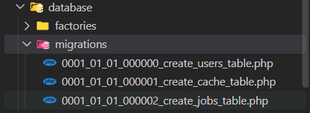

Com os nomes dos arquivos acima, já conseguimos entender um pouco sobre o que aconteceu e quando foi feito.

#### Reversível

Com o `migration`, conseguimos "voltar atrás" de algum versionamento, como o github, por exemplo:

- Criamos uma tabela, que já foi para o ar, existem usuários utilizando-a, mas aconteceu um erro, conseguimos "voltar atrás", revertendo essa ação.

**Como funciona**

Em qualquer `migration` nós temos uma função/método **`up()`**, que envia para o ar essa mudança no banco de dados.

E também temos a função **`down()`** para gente fazer um rollback caso seja necessário, por isso as migrations são reversíveis.

#### Compartilhável

Imagina que estamos a um projeto legacy de 5 anos atrás e não sabemos como configurar o banco de dados, sendo assim, o laravel resolve esse problema, com o comando `php artisan migrate` no terminal:

```bash
php artisan migrate
```

Desse jeito o `laravel` vai fazer tudo necessário e já vai rodar todas as tabelas, colunas, relacionamentos etc.

Por isso é tão fácil trabalhar com um sistema de compartilhamento de banco de dados com migrations.

#### Agnóstico

As migrations são agnósticas, o que signifca que, independente do banco de dados que os desenvolvedores estão utilizando (`sqlite | mysql | mongodb | etc.`) é função do `laravel` conversar com o banco de dados independente da linguagem de banco de dados utilizada.

Então, caso começamos o banco de dados com `SQLite` e queremos mudar para `mySQL`, com o `migrations` podemos realizar essa mudança de um modo muito simples.

### Criando migration

Para criar uma migration, podemos rodar o comando no terminal:

```bash
php artisan make:migration
```

Logo após isso, ele vai perguntar o nome da migration, é importante que sigamos um padrão para nomear a migration, exemplo: `create_habits_table`

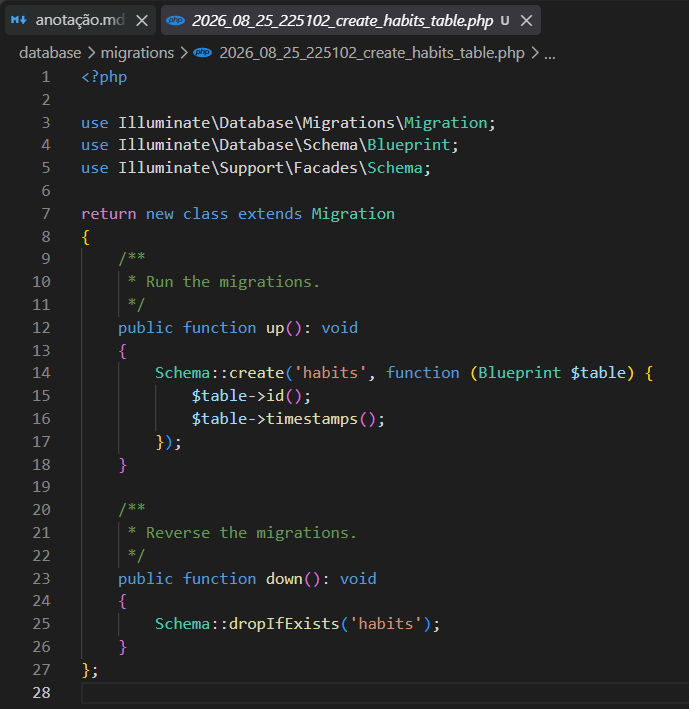
<small>*Migration criada*</small>

Agora que criamos a migration, o arquivo já foi criado dentro de `@/database/migrations`, mas ela não subiu ao ar ainda, ou seja, no nosso banco de dados, não vai existir essa tabela, podemos verificar o status das migrations com o comando:

#### Status migration

```bash
php artisan migrate:status
```

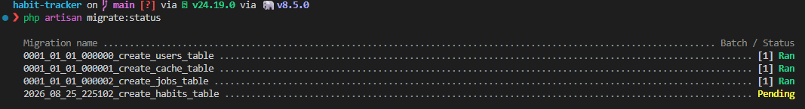
<small>*Status do migrate*</small>

E caso terminamos de configurar nossa migration, e queremos subir ela ao banco de dados, podemos rodar:

#### Upload migration

```bash
php artisan migrate
```

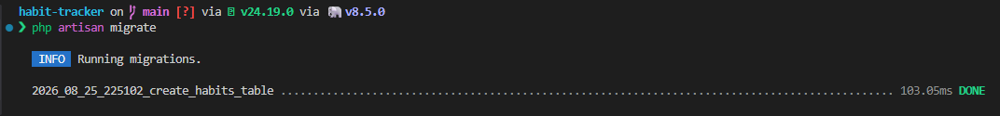
<small>*Migration subindo para o DB*</small>

### Deletando migrations

Existem alguns jeitos de removermos uma tabela do banco de dados via migrations, um desses jeitos é remover a partir de um rollback:

```bash
php artisan migrate:rollback
```

Desse modo, estamos dando um `rollback` para o último lote de migration executada, podemos observar os lotes com o [status](#status-migration) da migrate:

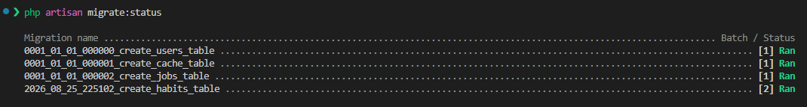

No nosso caso, criamos a migration `create_habits_table` no *`lote [2]`*, então se rodarmos o rollback direto, vamos voltar para as migrations no *`lote [1]`*.


<small>*Migration status depois do rollback*</small>

E agora, como o status está `pending`, podemos **deletar** o arquivo da migration com o status pendente.

#### Flags no rollback

- `--step=`: Indicamos quantas migrations queremos dar rollback a partir da última, por exemplo: <br/>
  `php artisan migrate:rollback --step=2` -> rollback nas duas últimas migrations.

- `--batch=`: Indicamos o lote em qual queremos dar rollback, por exemplo: <br/>
  `php artisan migrate:rollback --batch=1` -> rollback em todas as migrations no lote 1.

### Fresh

Existe um método nas migrations chamado `fresh`, aonde ele irá fazer um refresh da migration:

1. Deleta todas as tabelas;
2. Prepara o banco de dados;
3. Cria as migrations;
4. Roda as migrations;

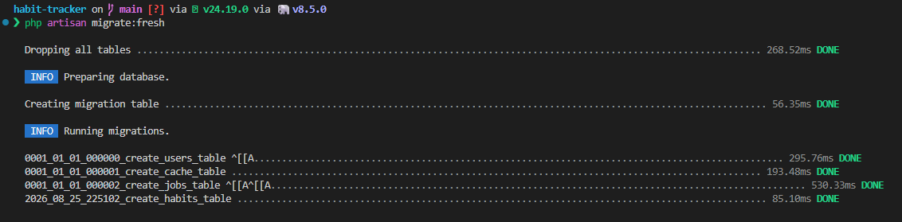
<small>*Fresh migration*</small>

Ele pode ser utilizado para atualizar uma tabela se fizermos uma alteração, por exemplo, excluírmos uma coluna ou alteramos um campo.

> O `fresh` nunca deve ser usado em produção, com o banco de dados já pronto;

### Alterando algum dado na tabela

Se formos alterar a tabela ou alguma coluna dentro da tabela, podemos fazer isso de duas maneiras:

- `migrate:fresh`
- `Criar uma nova migration`

Se estou em desenvolvimento, sem dados reais e quero alterar a migration original, posso usar o `migrate:fresh`;

Mas caso eu esteja em produção, e não posso perder esses dados, preciso criar uma nova migration, por exemplo, quero alterar o nome de uma tabela:

1. Criamos a migration `php artisan make:migration rename_table_user_to_clients`;
2. Dentro da migration rodamos: `Schema::rename('user', 'clients');`;
3. Subimos a migration ao DB: `php artisan migrate`;

Assim alteramos a estrutura sem apagar os dados existentes.

## Models

### O que são

- Representação das tabelas do banco de dados em forma de classe PHP;
- As models ficam guardadas na pasta `@/app/models/...`

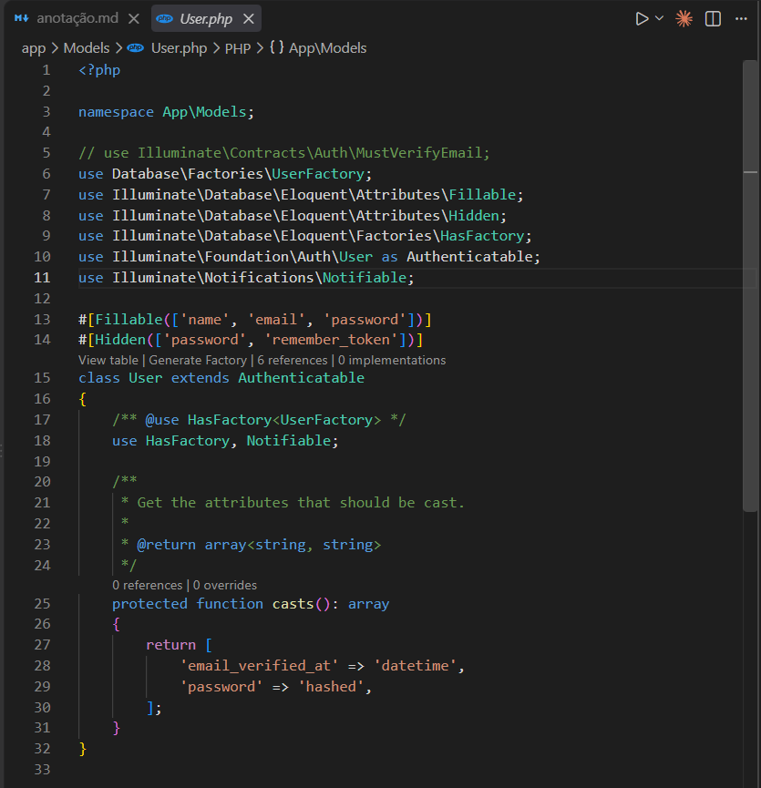
<small>*Exemplo de `Model` em `Laravel`*</small>

- Exemplo MYSQL

```sql
SELECT * FROM users WHERE email = 'andre@uranus.com.br'
```

- Exemplo c/ Laravel

```php
User::where('email', 'andre@uranus.com.br')->first()
```

- `User::`: Model User;
- `where()`: Método estátido where;
- `('email')`: Coluna "email" dentro da tabela;
- `('andre@uranus.com.br')`: Condição dentro de where para a coluna "email";
- `->first()`: Retornar o primeiro resultado encontrado;

Ou seja: na model user (`User`) onde (`where`) o email '<andre@uranus.com.br>' esteja dentro da coluna 'email' (`('email', 'andre@uranus.com.br')`) retorne o primeiro resultado (`->first()`);

### Fillable

As colunas marcadas como `$fillable` são campos em que o usuário ele tem controle, então, que ele possa mudar por conta própria, ou seja, todas as colunas que não estão marcadas com `$fillable` o usuário não tem controle.

### Hidden

As colunas marcadas como `$hidden` são campos em que são escondidos quando a model é convertida para array ou JSON, sendo assim, quando fizermos uma requisição em uma API para o banco de dados, os campos `$hidden` serão automaticamente removidos na resposta dessa requisição.

### Resumo

- `Migration`: Cria o banco de dados;
- `Model`: Representa o banco de dados;

## Sistema de login - Parte 1

Optamos por fazer o sistema de login antes que o sistema de cadastro, mas para ter um sistema de login, precisamos ter um usuário cadastrado no nosso banco de dados, por isso vamos utilizar uma técnica do laravel que consiste em popular o banco de dados com dados iniciais ou dados de teste, chamado `Seeders`

### Criando seeder

```bash
php artisan make:seeder UserSeeder
```

Aqui estamos criando uma `seeder` chamada `UserSeeder`, que fica disponível em: `@/database/seeders/UserSeeder.php`.

#### Populando tabela Users

Ao criar essa `seeder` temos a função pública `run()` que será executada quando enviarmos os dados para popular o banco de dados, na maioria dos casos, uma seeder vai inserir os dados em alguma tabela, no nosso caso, só temos a tabela `User` criada, ou seja, a model `User`, por isso vamos passar a função `::create([])` para a model `User` e dentro do array, passamos os dados das colunas que temos:

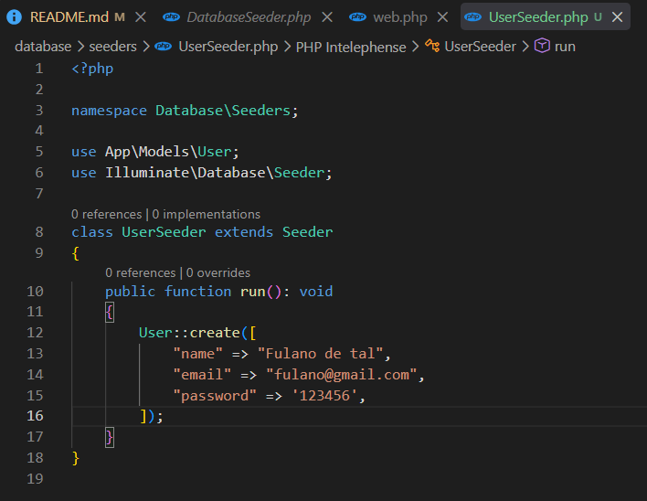

Após definir a função `create([])` e passar os dados das colunas, podemos subir esses dados para o banco de dados utilizando:

```bash
php artisan migrate:fresh --seed
```

Passamos a flag `--seed` porque o Artisan não roda seeders automaticamente depois de migrar, então sem essa flag você teria que rodar dois comandos separados:

- `php artisan migrate`
- `php artisan db:seed`

#### Arrumando factory

Ao criar um projeto com laravel, ele tenta criar uma **Fábrica de dados falsos** para enviar ao banco de dados, só que no nosso caso, a gente deletou algumas colunas do banco de dados, então quando rodamos o `php artisan migrate:fresh --seed`, ele vai retornar um erro, dizendo que não encontrou a coluna `email_verified_at`, já que deletamos ela na última seção.

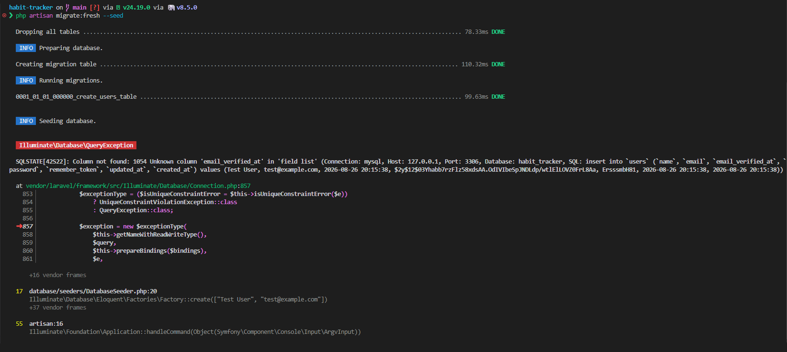

Desse modo, vamos entrar dentro do arquivo da `Factory` e arrumar esse problema, para que a factory envie os dados nas colunas existentes:

```php
// UserFactory.php

class UserFactory extends Factory
{
    protected static ?string $password;

    public function definition(): array
    {
        return [
            'name' => fake()->name(),
            'email' => fake()->unique()->safeEmail(),
            'password' => static::$password ??= Hash::make('password'),
        ];
    }
}
```

<small>*É assim como deve ficar o `UserFactory`*</small>

Após arrumar a factory, podemos rodar o `migrate:fresh` que os dados serão enviados ao banco de dados:

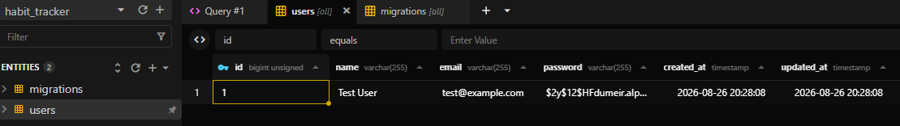
<small>*Dados enviados para a tabela users*</small>

Agora, podemos observar que os dados enviados para a tabela, foi diferente dos dados que definimos na `seeder`, isso acontece porque, criamos a `UserSeeder`, mas não estamos chamando a `seeder` em nenhum momento, vamos chamar o `seeder` dentro de `DatabaseSeeder.php` que é onde vamos chamar as `seeders` que criarmos:

```php
// DatabaseSeeder.php

namespace Database\Seeders;

use Illuminate\Database\Seeder;

class DatabaseSeeder extends Seeder
{
    public function run(): void
    {
        $this->call([
            UserSeeder::class,
        ]);
    }
}
```

Então, dentro da função `run()`, estamos enviando `$this->call([])`, aonde, dentro desse array é onde vamos enviar a `seeder`, enviamos um array, porque caso tenhamos mais de uma `seeder`, podemos enviar ela junto ao `call([])`.

Agora podemos dar `php artisan migrate:fresh --seed`, que os dados da `UserSeeder` serão enviados para o banco de dados:

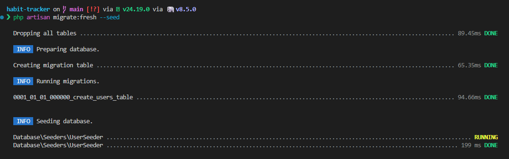
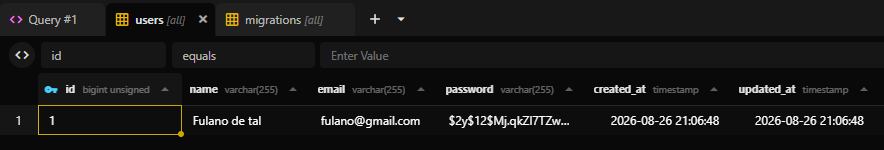

Podemos observar na tabela `password`, o dado está `hashed`, isso acontece por que na Model, é enviado uma função `casts()`, dizendo para o laravel que os dados da tabela `password` devem ser `hashed`.

```php
// User.php

protected function casts(): array
{
  return [
    'password' => 'hashed',
  ],
}
```

### Criando rota de login

Agora que criamos o nosso primeiro usuário, precisamos criar uma rota de login:

```php
// web.php

Route::get('/login', [LoginController]::class, 'index');
// Rota -> '/login'
// Controller -> 'LoginController'
// Função dentro do Controller -> 'index'
```

Aqui criamos um novo controller `LoginController` que vai estar dentro da pasta `@/App/Http/Controllers/Auth/LoginController`;

> Criamos a pasta `Auth`, para deixar todos os controllers relacionados com o login nessa pasta, podemos criar esse controller com o seguinte comando:
>
> ```bash
> php artisan make:controller Auth/LoginController
> ```

### Criando view login

No nosso método `index` dentro de `LoginController` vamos definir apenas a nossa view:

```php
// LoginController

public function index()
{
  return view('login');
}
```

Mas, precisamos criar a nossa view, então dentro da pasta `@resources/views` vamos duplicar o arquivo `home.blade.php` e renomear para `login.blade.php`.

### Recuperando tabela sessions

Após criar, se formos ao navegador, podemos perceber um erro `Base table or view not found: Table 'habit_tracker.sessions' doesn't exists`, por que esse erro está acontecendo, na última aula, deletamos a tabela `sessions` do banco de dado

- Para recuperar essa tabela, podemos ir no último commit do github e copiar o código em que foi criado a tabela `sessions` na função `up()` na nossa migration, e também fazer o drop dessa tabela na função `down()`:
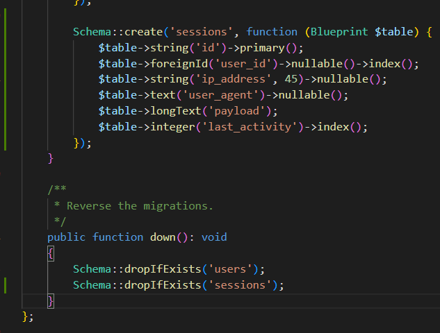

E para subir essa migration para o ar, e criar essa tabela no banco de dados, é só fazer: `php artisan migrate:fresh --seed`, passando a flag `--seed` para também enviar os dados da `seeder`.

## Sistema de login - Parte 2

### Criando página de login

```html
// login.blade.php

<x-layout>
  <main>
    <h1>
      Faça login.
    </h1>

    <section class="mt-4">
      <form action="/login" method="post">
        <input 
          type="email" 
          name="email" 
          placeholder="your@email.com" 
          class="bg-white p-2 border-2"
        >
        
        <input 
          type="password" 
          name="password" 
          placeholder="********" 
          class="bg-white p-2 border-2"
        >

        <button type="submit" class="bg-white p-2 border-2">
          Enviar
        </button>
      </form>
    </section>
  </main>
</x-layout>
```

- `form action="/login" method="post"` -> Indicando que os dados desse post vão para a rota `/login` e o método será `POST`, então temos que criar um `Route::post()` dentro de `routes/web.php`:

### Criando rota POST

```php
// web.php

Route::post('/login', [LoginController::class], 'authenticate')
```

- Aqui estamos criando um método `POST` na rota `/login`, passando o `LoginController` na função `authenticate`;
- A função `authenticate` será quem irá receber os dados da request;

### Validação de formulário - CSRF

No momento em que definimos um formulário em HTML, devemos incluir o `campo de token CSRF` para que o middleware do `CSRF` possa validar a requisção, isso é feito a partir da inclusão da diretiva `@csrf` dentro de um arquivo `blade.php`;

> **`CSRF`**: é um tipo de ataque em que um site malicioso engana o navegador para que ele envie uma requisição indesejada a outra aplicação.
>
> **`Porque é perigoso`**: O ataque explora a confiança que o servidor deposita no navegador do usuário autenticado. Qualquer ação que dependa dos cookies de sessão pode ser forjada: trocar senha, alterar e-mail, fazer compras etc.

```html
// login.blade.php

<form>
@crsf
...
</form>
```

### Criando função Authenticate dentro de LoginController

```php
public function authenticate(Request $request)
{

}
```

- `$credentials = $request->validate([])`: Aqui é onde vamos validar os campos e salvar em `$credentials`;
- `if(Auth::atempt($credentials))`: Verificando se os dados passados pela `$credentials` são verdadeiras ou falsas;
- `$request->session()->regenerate()`: Se as credenciais forem reais, estamos gerando uma nova sessão para o usuário, sessão de usuário logado;
- `return redirect()->intended('/')`: Depois de gerar a nova sessão do usuário, redirecionamos ele para a rota `'/'`;
- `else: return back()->withErrors(['email' => 'Credenciais inválidas])`: Caso as `$credentials` estejam erradas, vamos redirecionar o usuário de volta com o `back()` e mostrar um erro no campo `'email'` com o `withErrors([])`;

### Passando o erro na página de login

Ao direcionar o usuário de volta com um erro retornado pelo método `withErrors([...])`, vamos criar uma seção para mostrar esse erro para o usuário.

```html
<!-- login.blade.php -->

<div>
  @error('email') 
    <p>
      {{ $message }} 
    </p>
  @enderror
</div>
```

### Passando mensagem de bem vindo para usuários logados

```php
<!-- home.blade.php -->
@auth
  <p>
    Bem vindo {{ auth()->user()->name }}!
  </p>
@endauth
```

## Criando sistema de logout + Middleware

Aqui vamos criar o sistema de logout e entender mais o que são os Middlewares.

### Criando rota de logout

```php
// web.php

Route::post('/logout', [LoginController::class], 'logout');
```

### Criando função de logout

```php
// LoginController

public function logout(Request $request): RedirectResponse
{
  // Deslogando o usuário:
  Auth::logout();

  // Limpando os dados da sessão e re-gerando outro ID:
  $request->session()->invalidate();

  // Regenerando o valor do token CSRF da sessão:
  $request->session()->regenerateToken();

  // Redirecionando o usuário para a página inicial:
  return redirect()->intended(route('site.index'));
}
```

### Passando middleware nas rotas

Os middlewares são basicamentes como porteiros, que vão fazer uma verificação antes de deixar o usuário fazer uma requisição ou acessar uma rota.

> 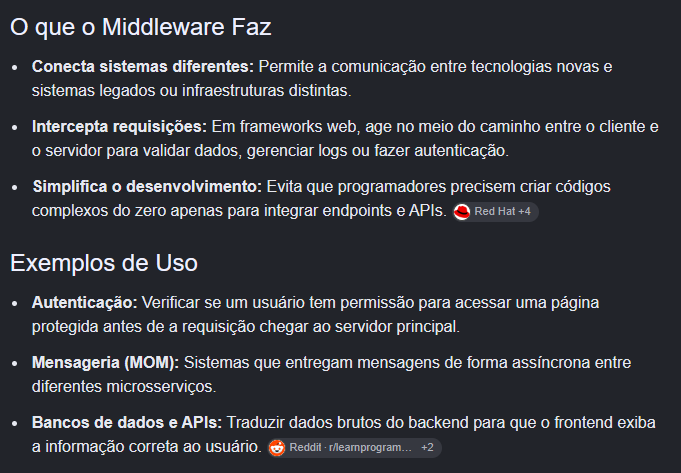

Podemos passar o middleware em dois jeitos:

1) Passando em apenas uma rota:
```php
// web.php

Route::post('/logout', [LoginController::class], 'logout')->middleware('auth');
```

2) Agrupando as rotas e passando o middleware:
```php
// web.php

Route::middleware('auth')->group(function () {
  Route::get('/dashboard', [SiteController::class], 'dashboard');
  Route::post('/logout', [LoginController::class], 'logout');
});
```

### Nomeando rotas

Imagine que por algum motivo precisamos trocar a URL da rota, para evitar toda a refatoração do código de todos os redirecionamentos, chamadas etc. para a nova rota, podemos nomear ela, evitando esse re-trabalho:

```php
// web.php

Route::get('/', [SiteController::class], 'index')->name('site.index');
```

Aqui nomeamos a rota como `site.index`, e vamos chamar ela com a função:
```php
route('site.index')
```

Lembrando que em caso de arquivos com html com php inserido, precisamos passar os métodos envolto de `{{ @method }}`;

## Criando validação de formulário com o Form Request Validation

No nosso projeto atualmente, estamos validando a requisição dentro do próprio controller utilizando o método: `validate([])`, mas podemos melhorar isso criando uma própria `Request` do laravel, com o comando:

```bash
php artisan make:request
```

### Vantagens

- **Separação de responsabilidades:** O controller deve orquestrar a lógica de negócio(autenticar, redirecionar etc.), não ficar poluído com regras de validação;
- **Reutilização:** Se precisar validar o login em mais de um lugar (por exemplo, um endpoint de API além do form web), a classe `LoginRequest` pode ser reaproveitada.
- **Mensagens de erros centralizadas:** As mensagens customizadas ficam num único lugar `LoginRequest::messages()`, junto das regras que elas descrevem, em vez de espalhadas em cada controller que precisar validar algo parecido.

### Criando validação dentro de LoginRequest

Agora precisamos definir as regras de validação, e também a autorização do usuário, ou seja, o que o usuário precisa para fazer essa requisição, nesse caso, para fazer login não precisa de nada, então podemos definir como `true`:

```php
// LoginRequest.php

class LoginRequest extends FormRequest
{
  // Autorização
  public function authorize(): bool
  {
    return true;
  }

  // Regras da validação
  public function rules(): array
  {
    return [
      'email' => 'email|required',
      'password' => 'required|min:6|max:60',
    ];
  }

  // Mensagens de erro customizadas
  public function messages(): array
  {
    return [
      'email.required' => 'O campo e-mail deve ser obrigatório.',
      'email.email' => 'O campo e-mail deve conter um endereço válido',
      'password.required' => 'O campo senha é obrigatório',
      'password.min' => 'O campo senha deve ter no mínimo 6 caracteres',
      'password.max' => 'O campo senha deve ter no máximo 60 caracteres',
    ];
  }
}
```

### Pasando as validações para o controller

Agora, não precisamos mais usar o método `validate()`:

```php
public function authenticate(LoginRequest $request)
{
  // Salvando os dados que vieram do LoginRequest
  $credentials = $request->only("email", "password");
}
```

### Melhorando interface de login

```html
<x-layout>
  <main>
    <section class="bg-white max-w-150 mx-auto p-10 border-2 mt-4">
      <h1 class="font-bold text-3xl">
        Faça login.
      </h1>

      <p>
        Insira seus dados para acessar
      </p>

      <form action=<{{ route('auth.login') }} method="post">
        @csrf
        <!-- EMAIL -->
        <div class="flex flex-col gap-2 mb-4">
          <label for="email">Email</label>
          <input type="email" name="email" placeholder="your@email.com"
            class="bg-white p-2 border-2 @error('email') border-red-500 @enderror">

          @error('email')
            <p class="text-red-500 text-sm">
              {{ $message }}
            </p>
          @enderror
        </div>

        <!-- PASSWORD  -->
        <div class="flex flex-col gap-2 mb-4">
          <label for="password">Password</label>
          <input type="password" name="password" placeholder="********"
            class="bg-white p-2 border-2 @error('password') border-red-500 @enderror">

          @error('password')
            <p class="text-red-500 text-sm">
              {{ $message }}
            </p>
          @enderror
        </div>

        <!-- SUBMIT -->
        <button type="submit" class="bg-white p-2 border-2">
          Enviar
        </button>
      </form>
    </section>
  </main>
</x-layout>
```